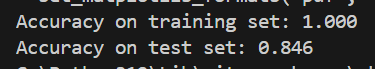

# 🧠 MNIST Classification avec un Arbre de Décision

Ce projet est un exemple simple de classification d’images manuscrites de chiffres utilisant le jeu de données **MNIST** et un modèle de **Decision Tree Classifier** de `scikit-learn`. Il a été réalisé dans le cadre d’un cours d’intelligence artificielle à l’université de Trente.

## 📚 Objectif

Construire un modèle capable de prédire le chiffre (0 à 9) représenté par une image 28x28 pixels, en niveaux de gris, en utilisant un **modèle supervisé d'arbre de décision**.

## 🛠️ Librairies utilisées

- `numpy`, `pandas` : manipulation des données
- `matplotlib`, `mglearn` : visualisation
- `scikit-learn` : modèle de machine learning (DecisionTreeClassifier)
- `fetch_openml` : téléchargement du dataset MNIST

## 🔬 Théorie

Le modèle utilisé est un **arbre de décision** :
- Divise récursivement l’espace de caractéristiques en zones homogènes.
- Utilise des critères comme l’indice de Gini pour choisir les meilleurs découpages.
- Très interprétable, mais peut sur-apprendre si non limité en profondeur.

## 📊 Résultats

Une fois entraîné :
- Le modèle obtient une excellente précision sur les données d'entraînement (indiquant un sur-apprentissage probable).
- La précision sur les données de test est significativement plus basse.

## 🖼️ Visualisation

Le script contient une fonction `test_valeur_aleatoire()` qui :
- Affiche une image aléatoire du dataset MNIST.
- Prédit la valeur du chiffre associé via le modèle entraîné.

### Visualisation des résultats

Précision du modèle sur les données d'entraînement et de test :  

Exemple de prédiction pour une image MNIST aléatoire :  

